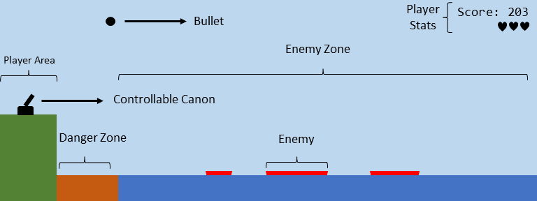
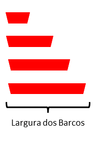

# Projeto Fundamentos de Programação 2022/2023

## Introdução 
Todos os grupos devem implementar em Python e PyGame um jogo chamado *Heavy Ordnance*. Este jogo necessita **obrigatóriamente** interface gráfica em PyGame.

## Contexto do Jogo

Neste jogo o jogador controla a artilharia de uma base costeira, onde o objetivo é afundar todos os barcos inimigos que se vão aproximando deste. O jogo é jogado definindo a velocidade de lançamento do projectil e o angulo do canhão, resultando num movimento *parabólico* no qual o objetivo é encontrar a velocidade e o angulo *certo* para acertar nos vários inimigos no ecrã.

### Objectivo do Jogo

O objectivo do jogo é *aguentar* o maior numero de tempo possível enquanto este defende a sua zona de controlo dos barcos inimigos. O jogo termina quando o total de 3 barcos inimigos atinge (ou collide) a *zona de controlo* do jogador. 

### Interface

A interface do jogo consiste numa janela de 1000x380px (1000px largura e 380px altura) com os seguintes elementos:

- **Player Area:** O local onde se encontra a artilharia do jogador
- **Controllable Canon:** Isto é o canhão que o jogador controla, assim definindo o *angulo* do lançamento do projétil  
- **Bullet:** Representa o projétil lançado pelo jogador, se este collidir com um barco inimigo este é afundado (i.e. one hit kill)
- **Enemy Zone:** Representa a area de jogo onde os barcos inimigos se encontram. Estes vão navegando da direita para a esquerda até ao *danger zone*
- **Danger Zone:** Representa a area de perigo, quando um barco inimigo collide com esta zona o jogador *perde uma vida* e o barco inimigo desaparece
- **Players Stats:** Representa o score corrente do jogador e o numero de vidas restantes

### Descrição Técnica

#### Fluxo do Sistema de Menus

O jogo deve apresentar uma estrutura semelhante ao projeto anterior. Deve conter um start e um game over screen e um leaderboard que apresenta e guarda as pontuações passadas dos jogadores. O jogador deverá ter a opção de sair do jogo (a qualquer momento, mesmo durante o gameplay) de forma eficiente e controlada. No start screen o jogador também deverá ter a opção de visualizar o leaderboard.

#### Gameplay - Canon

O jogo é jogado em tempo real onde o canhão do jogador é controlado pelo movimento do rato (ou seja mover o rato para a esquerda ou para a direita altera o angulo do canhão). Para disparar o canhão o jogador tem que carregar no botão do rato e pode ficar a carregar para aumentar a sua velocidade $v_{0}$ até uma destas condições ser verdadeira:

- O jogador larga o botão do rato 
- A velocidade maxima é atingida (definida pelo grupo)

#### Gameplay - Projétil 

O projetil é definido pelas seguintes equações para o vector *x* e *y*:

$$ x = x_{0} + v_{0} t cos(\theta) $$ 

$$ y = y_{0} + v_{0} t sin(\theta) - \dfrac{1}{2}gt^2 $$

Onde $x_{0}$ e $y_{0}$ são as posições iniciais de *x* e *y* respectivamente, $v_{0}$ é a velocidade inicial do projétil, *t* é o tempo, $\theta$ é o ângulo do canhão e *g* é a força gravita que é igual a *9.8*.

O projétil desaparece quando este:

- Collide com o chão
- Collide com um barco inimigo
- Vai para além da largura definida do ecrã

##### Frequência de Disparo

É importante considerar a frequência do disparo e o tempo de recarga neste jogo, ou seja o jogador só consegue disparar se todas estas condições são verdadeiras:

- Passou 1s desde o ultimo disparo
- Não há mais do que 2 projéteis em jogo
 
#### Gameplay - Inimigos

A velocidade de todos os inimigos é controlada por uma variavel que aumenta gradualmente ao longo do jogo cada vez que o jogador afunda 10 barcos, ou seja por cada 10 inimigos destruídos esta variavel incrementa a velocidade **immediatamente**.

Cada inimigo pode variar em largura, com um grau de variabilidade (ver abaixo):

##### Frequência dos Inimigos

Cada inimigo tem que ser **obrigatóriamente** criado na secção mais a direita do enemy zone. O jogo cria inimigos se todas as condições assinaladas abaixo são verdadeiras:

- Não existe mais do que 4 barcos no enemy zone
- Passou um valor aleatório de tempo desde a destruíção do ultimo barco pelo jogador

#### Calculo de Pontos

O score do jogador é calculado da seguinte forma:

- Por cada segundo que passa no jogo, incrementamos o score por 1 ($S_{t})
- Por cada barco destruído o valor do score é inversamente proporcional ao tamanho do barco ($P_{b}$):
	- Tiny Boat: 5 pts
	- Small Boat: 4 pts
	- Medium Boat: 3 pts
	- Large Boat: 2 pts
	- Huge Boat: 1 pts
- Por cada 10 barcos afundados, o multiplier dos barcos destruídos incrementa por 1, ou seja a função de barcos destruídos equivale a:

$$ S_{b} = P_{b} * mul $$

onde $S_{b}$ é o total de score obtido ao abater o barco especifico *b*, $P_{b}$ é o valor dos pontos associado ao barco *b* e *mul* é a variavel *multiplier* que incrementa por todos os 10 barcos afundados até ao momento do jogo.

Logo o valor total do player score $S$ é a soma total de $S_{t}$ e $S_{b}$ ao longo do jogo.

#### Leaderboards

O leaderboard deve guardar as iniciais e score dos 10 melhores jogadores até à data. O jogo deve pedir as iniciais do jogador caso o score obtido no final for maior do que ultimo valor presente no leaderboard.

O leaderboard deverá ser permanente (mesmo quando se desliga o jogo), e para isso é necessário escrever para um ficheiro os valores destes. Para tal é necessario usar funções de read e write para um ficheiro de texto que irá ser guardado na pasta local do jogo. Funções uteis para ver:

- [Read File](https://www.w3schools.com/python/python_file_open.asp)
- [Write File](https://www.w3schools.com/python/python_file_write.asp)

## Objetivos e Critério de Avaliação

Este projeto tem os seguintes objetivos:

-   **O1** - Programa deve funcionar como especificado. Atenção aos detalhes, pois é fácil desviarem-se das especificações caso não **leiam o enunciado com atenção**.
-   **O2** - Projeto e código bem organizados, nomeadamente:
    -   Código devidamente comentado e indentado.
    -   Inexistência de código "morto", que não faz nada, como por exemplo variáveis, propriedades ou métodos nunca usados.
    -   Projeto compila e executa sem erros e/ou _warnings_.
-   **O3** - Projeto adequadamente documentado com *comentários* descrevendo a funcionalidade de várias secções do código.
-   **O4** - Repositório Git deve refletir boa utilização do mesmo, nomeadamente:
    -   Devem existir _commits_ de todos os elementos do grupo, _commits_ esses com mensagens que sigam as melhores práticas para o efeito (como indicado [aqui](https://chris.beams.io/posts/git-commit/), [aqui](https://gist.github.com/robertpainsi/b632364184e70900af4ab688decf6f53), [aqui](https://github.com/erlang/otp/wiki/writing-good-commit-messages) e [aqui](https://stackoverflow.com/questions/2290016/git-commit-messages-50-72-formatting)).
    -   Ficheiros binários não necessários, não devem estar no repositório. Ou seja, devem ser ignorados ao nível do ficheiro `.gitignore`.
-   **O5** - Relatório em formato [Markdown](https://guides.github.com/features/mastering-markdown/) (ficheiro `README.md`), organizado da seguinte forma:
    -   Título do projeto.
    -   Autoria:
        -   Nome dos autores (primeiro e último) e respetivos números de aluno.
        -   Informação de quem fez o quê no projeto. Esta informação é **obrigatória** e deve refletir os _commits_ feitos no Git.
        -   Indicação do repositório Git utilizado. Esta indicação é opcional, pois podem preferir manter o repositório privado após a entrega.
    -   Arquitetura da solução:
        -   Descrição da solução, com breve explicação de como o código foi organizado, bem como dos algoritmos não triviais que tenham sido implementados.
    -   Referências, incluindo trocas de ideias com colegas, código aberto reutilizado (e.g., do StackOverflow) e bibliotecas de terceiros utilizadas. Devem ser o mais detalhados possível.
    -   **Nota:** o relatório deve ser simples e breve, com informação mínima e suficiente para que seja possível ter uma boa ideia do que foi feito. Atenção aos erros ortográficos e à correta formatação [Markdown](https://guides.github.com/features/mastering-markdown/), pois ambos serão tidos em conta na nota final.

O projeto tem um peso de 5 valores na nota final da disciplina e será avaliado de forma qualitativa. Isto significa que todos os objetivos têm de ser parcialmente ou totalmente cumpridos. A cada objetivo, O1 a O5, será atribuída uma nota entre 0 e 1. A nota do projeto será dada pela seguinte fórmula:

N = 10 x O1 x O2 x O3 x O4 x O5

Em que _D_ corresponde à nota da discussão e percentagem equitativa de realização do projeto, também entre 0 e 1. Isto significa que se os alunos ignorarem completamente um dos objetivos, não tenham feito nada no projeto ou não comparecerem na discussão, a nota final será zero.

### Requisito Mínimo do Projeto

Tudo descrito no enunciado são as funcionalidades minimas para este projeto, e isto inclui:

- Interface de Jogo
- Sistema de Menus
- Gameplay - Canon
- Gameplay - Projecteis
- Gameplay - Inimigos
- Leaderboards

### Pontuação Extra

**Importante**: Façam o minimo requerido primeiro antes de tentarem fazer mais funcionalidades!

- Sistema de Audio
- Sistema de "Power-Ups"
- Sistema de Particulas
- Graficos e Animações mais complexas

## Entrega
O projeto deve ser entregue por **grupos de 2 alunos** via Moodle até às **23:59** do dia **20 de Janeiro 2023**. Um (e apenas um) dos elementos do grupo deve ser submeter um ficheiro `zip` com a solução completa, nomeadamente:

-   Pasta escondida `.git` com o repositório Git local do projeto.
-   Pasta do projeto, contendo os ficheiros todos deste.
-   Ficheiro `README.md` contendo o relatório do projeto em formato [Markdown](https://guides.github.com/features/mastering-markdown/).
-   Ficheiro de imagem contendo o Fluxograma. Este ficheiro deve ser incluído no repositório em modo Git LFS.
-   Outros ficheiros de configuração, como por exemplo `.gitignore` e `.gitattributes`.

**Não serão avaliados projetos sem estes elementos e que não sejam entregues através do Moodle.**

## Honestidade académica
Nesta disciplina, espera-se que cada aluno siga os mais altos padrões de honestidade académica. Isto significa que cada ideia que não seja do aluno deve ser claramente indicada, com devida referência ao respectivo autor. O não cumprimento desta regra constitui plágio.

O plágio inclui a utilização de ideias, código ou conjuntos de soluções de outros alunos ou indivíduos, ou quaisquer outras fontes para além dos textos de apoio à disciplina, sem dar o respectivo crédito a essas fontes. Os alunos são encorajados a discutir os problemas com outros alunos e devem mencionar essa discussão quando submetem os projetos. Essa menção **não** influenciará a nota. Os alunos não deverão, no entanto, copiar códigos, documentação e relatórios de outros alunos, ou dar os seus próprios códigos, documentação e relatórios a outros em qualquer circunstância. De facto, não devem sequer deixar códigos, documentação e relatórios em computadores de uso partilhado, e muito menos usar repositórios Git públicos (embora os mesmos possam ser tornados públicos 12h após a data limite de submissão).

Nesta disciplina, a desonestidade académica é considerada fraude, com todas as consequências legais que daí advêm. Qualquer fraude terá como consequência imediata a anulação dos projetos de todos os alunos envolvidos (incluindo os que possibilitaram a ocorrência). Qualquer suspeita de desonestidade académica será relatada aos órgãos superiores da escola para possível instauração de um processo disciplinar. Este poderá resultar em reprovação à disciplina, reprovação de ano ou mesmo suspensão temporária ou definitiva da ULHT.

_Texto adaptado da disciplina de [Algoritmos e Estruturas de Dados](https://fenix.tecnico.ulisboa.pt/disciplinas/AED-2/2009-2010/2-semestre/honestidade-academica) do [Instituto Superior Técnico](https://tecnico.ulisboa.pt/pt/)_

## Licenças
Este enunciado é disponibilizado através da licença [CC BY-NC-SA 4.0](https://creativecommons.org/licenses/by-nc-sa/4.0/).

## Metadados
-   Autores: [Phil Lopes](https://github.com/worshipcookies) e [Diogo Andrade](https://github.com/DiogoDeAndrade)
-   Curso: [Licenciatura em Videojogos](https://www.ulusofona.pt/licenciatura/videojogos)
-   Instituição: [Universidade Lusófona de Humanidades e Tecnologias](https://www.ulusofona.pt/)

